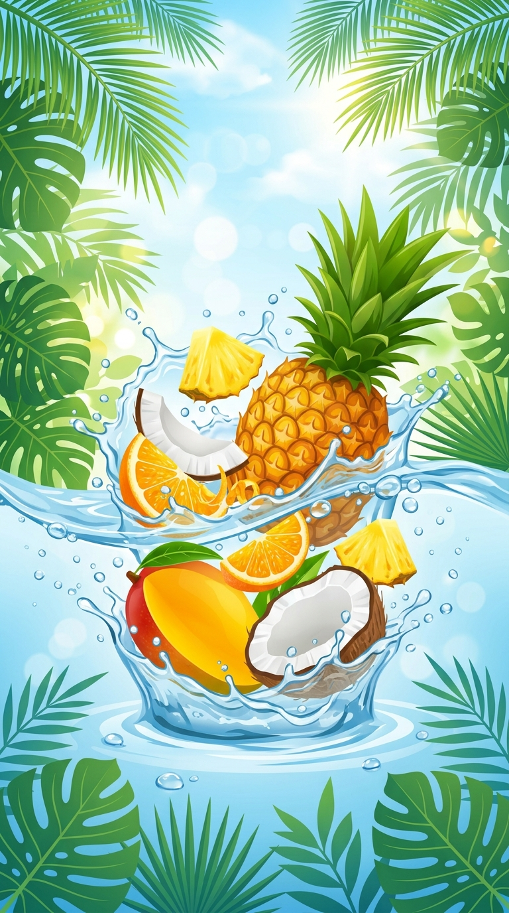
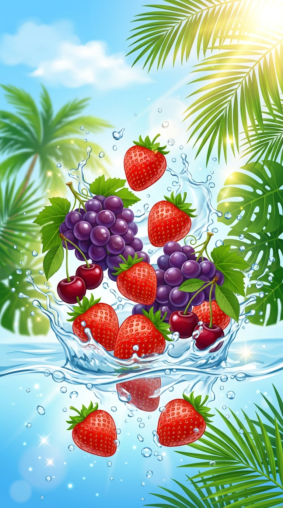

# C.I.P Drink Label Designer & 3D Previewer - Walkthrough

I have completed the development of the **C.I.P Drink Label Designer & 3D Previewer** application! 

The application is written in vanilla HTML, CSS, and JS, incorporating **Three.js** for real-time 3D bottle texture mapping and **html2canvas** for rendering high-DPI print-ready downloads.

---

## Generated Visual Assets

I generated three stunning, high-quality tropical summer illustrations utilizing the image generation tool. These serve as the background graphics for the labels and are stored in the `assets/` folder:

### 1. Tropical Fruits & Water Splash

*Used for: Pineapple, Mango, Fruit Punch, and Kola Champagne.*

### 2. Berries, Grapes & Cherries Splash

*Used for: Strawberry, Grape, and Cherry.*

### 3. Hibiscus (Sorrel) & Ginger Splash

*Used for: Sorrel & Ginger.*

---

## Created Application Files

All application files are located in the project folder:
- **index.html**: Main HTML structure. Features the interactive sidebar control panel (for choosing sizes, flavors, bottle volume state, and custom text inputs), a 2D Flat printable label blueprint preview, and a Three.js 3D Bottle View scene wrapper.
- **index.css**: Glassmorphic dark theme dashboard UI, custom HSL color palette definitions for the different flavor themes, standard grid alignment for the triple-panel label layout, and responsive styles for tablets/mobiles.
- **app.js**: Holds the flavor config databases, updates the live HTML 2D label DOM dynamically based on parameters, initializes Three.js, models the bottle liquid and glass meshes, maps the dynamically captured canvas texture, and handles the 300 DPI high-quality PNG download.

---

## How to Run the Application on your Mac

Because modern browsers enforce security restrictions (CORS) that block Three.js from loading images from raw `file://` URLs, **you must run a local web server** to render the 3D bottle preview correctly.

Follow these simple steps:

### 1. Start a Local Web Server
You can launch a web server instantly using Python or Node.js in your Terminal inside the project directory:

**Using Python:**
```bash
python3 -m http.server 8080
```

**Using Node/NPX:**
```bash
npx http-server -p 8080
```

### 2. Open in Browser
Navigate to:
[http://localhost:8080](http://localhost:8080)

You will see the fully functional studio dashboard! You can rotate the 3D bottle mockup with your mouse, type in custom text, adjust dimensions, and hit download to save print-ready files.
